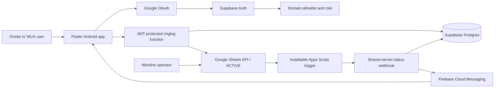

# CHGLog Technical Architecture

## Purpose

CHGLog provides a controlled Android workflow around the `ACTIVE` Google Sheet.
It validates company identities, finds exact CHG numbers, records check-ins,
links hotline-assisted records, displays personal activity history, and sends
status notifications.

## System context

## Components

### Flutter Android application

- Google sign-in through Supabase Auth.
- Exact `CHG` plus seven digits validation.
- Sheet-backed search and change-detail display.
- Required onsite details form for `onsite` users.
- One-tap **Add to my activities** for `wln` users.
- Manual-record claiming and linked-detail editing.
- Date-filtered activity history with graveyard carryover.
- Firebase device-token registration and push notifications.

The app receives only publishable client configuration. Privileged credentials
remain in Supabase secrets.

### Supabase Auth and authorization

The Before User Created hook checks `allowed_email_domains`. Each domain has a
server-controlled `user_role`:

| Role | Behavior |
| --- | --- |
| `onsite` | Name, company, and contact are required for check-in. |
| `wln` | User can add a CHG directly to personal activities. |

`globe.com.ph` is configured as `wln`; approved vendor domains remain
`onsite`. The `chglog` function repeats allowlist and role checks on every call.

### Google Sheet contract

| Column | Purpose |
| --- | --- |
| B | Title |
| C | Objective |
| I | One or more CHG tokens |
| O | Status |
| P | Login time (`HHmmH`) |
| Q | Logout time (`HHmmH`) |
| T | Labeled implementer details |
| U | Proponent |

Supported statuses are `login`, `ongoing pre-checks`, `ongoing planned`,
`ongoing post-checks`, and `implemented`.

### Edge Functions

`chglog` requires a valid Supabase JWT. It searches and writes the Sheet,
creates or updates user activities, registers FCM tokens, and lists the current
user's activities.

`sheet-status-webhook` does not use user JWTs. It requires the private
`X-CHGLog-Webhook-Secret` header, accepts Apps Script events, synchronizes
manual records and statuses, and sends FCM messages.

### Data model

`activities` stores the CHG snapshot, status, timestamps, source (`app` or
`manual`), user association, onsite details, and WLN implementer. A null
`user_id` represents an unassigned hotline record. Row-level security exposes
only records whose `user_id` equals the authenticated user.

`device_tokens` maps FCM tokens to users. `notifications` stores notification
history and cascades when an activity is removed. `allowed_email_domains`
contains authorized domains and roles.

Activities older than one calendar month are deleted by a daily `pg_cron` job.

## Key flows

### Authentication

1. The app obtains a Google ID token.
2. Supabase verifies Google authentication.
3. The Auth Hook rejects domains absent from the allowlist.
4. Each API call rechecks the domain and resolves its role in Supabase.

### Onsite check-in

1. User searches an exact CHG.
2. The function reads the matching Sheet row.
3. The user submits required onsite name, company, and contact.
4. The function writes O, P, and T and creates an activity owned by that user.

### WLN participation

1. A `wln` user searches a CHG.
2. **Add to my activities** creates or claims an activity without onsite data.
3. The action does not overwrite column T.

### Hotline-assisted record

1. An operator enters status/time/details in O, P, and T.
2. Apps Script sends the row to the webhook.
3. A manual activity is created. An exact Auth email match links it to a user;
   otherwise `user_id` remains null.
4. An approved user can later complete and claim an unassigned record.

### Status notification

1. An operator edits column O.
2. Apps Script writes Q when status becomes `implemented` and calls the webhook.
3. Supabase updates linked activities and notification history.
4. FCM delivers the status message to registered Android devices.

## Security boundaries

- Google service-account, Firebase Admin, service-role, and webhook credentials
  are server-side secrets and must never be committed or bundled in the APK.
- The public Edge Function is JWT protected; the webhook uses a separate strong
  shared secret.
- RLS prevents users from reading another user's activity history.
- Manual claiming is atomic and succeeds only while `user_id` is null.
- Sheet access is granted only to the Google service account and authorized
  operational users.

